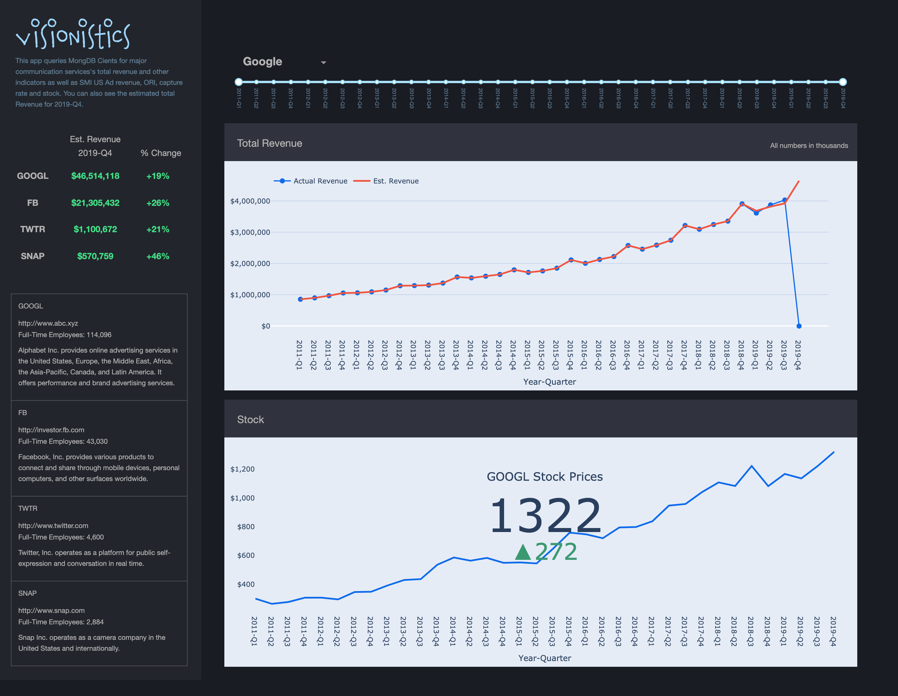

# Visionistics 
### [Veiw on Website](https://visionistics.herokuapp.com/)


This app queries MongDB Cients for major communication services's total revenue and other indicators as well as SMI US Ad revenue, ORI, capture rate and stock. You can also see the estimated total Revenue for 2019-Q4.

## How to run this app

To run this app first clone repository and then open a terminal to the app folder.

```
git clone https://columbia.bootcampcontent.com/Hyerim.Hwang/visionistics.git
cd visionistics
```

Create and activate a new virtual environment (recommended) by running
the following:

On Windows

```
virtualenv venv 
\venv\scripts\activate
```

Or if using linux

```bash
python3 -m venv myvenv
source myvenv/bin/activate
```

Install the requirements:

```
pip install -r requirements.txt
```
Run the app:

```
python app.py
```
You can run the app on your browser at http://127.0.0.1:8050

## Resources

To learn more about Dash, please visit [documentation](https://plot.ly/dash).